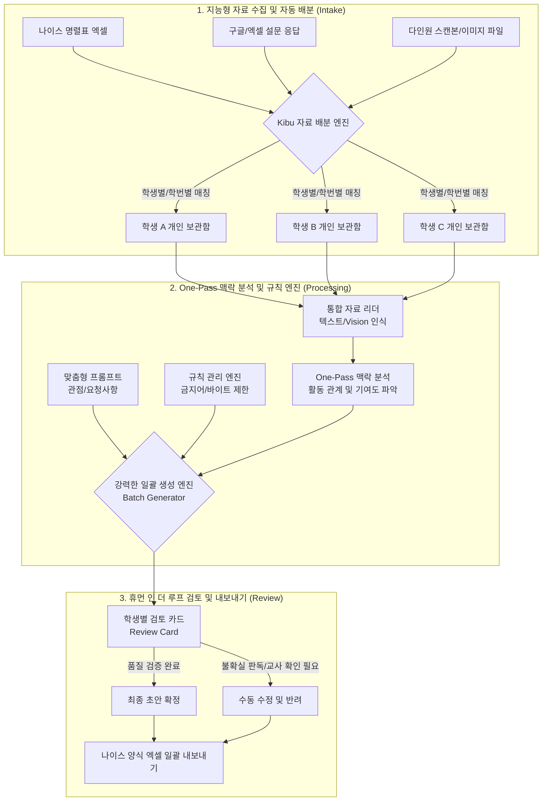

# Kibu 시스템 아키텍처 및 홍보 기획서

## 1. Kibu 시스템 핵심 아키텍처 (System Architecture)

Kibu의 동작 과정은 크게 **[데이터 수집/분배] → [AI 통합 분석 및 규칙 적용] → [초안 생성 및 검토]** 의 3단계로 나뉩니다.

---

## 2. 강화된 핵심 홍보 포인트 (Landing Page Messages)

기존의 "자료를 요약해 줍니다"에서 한 차원 더 나아간, **"교사의 번거로운 단순 반복 업무(분류, 생성, 규칙 검증)를 시스템이 완벽하게 자동화합니다"**로 메시지를 상향 조정합니다.

### 🌟 포인트 1: 똑똑한 "자료 자동 배분" 시스템 (Data Distribution)
*   **기존 방식:** 명렬표를 가져와서 학생별로 개별적으로 자료를 등록해야 했습니다.
*   **강조 포인트:** "설문 엑셀 파일 하나, 통째로 스캔한 결과물 파일 하나만 던져주세요."
    *   나이스 명렬표뿐만 아니라, **설문 응답 자료**, **여러 학생이 섞인 스캔본**을 시스템이 인식하여 학생별 개인 보관함으로 알아서 척척 배분합니다. 교사의 자료 분류 시간이 0에 수렴합니다.

### 🌟 포인트 2: 차원이 다른 "강력한 일괄 생성" (Batch Generation)
*   **기존 방식:** 한 명씩 버튼을 눌러 초안을 확인하고 기다려야 했습니다.
*   **강조 포인트:** "학급 전체의 생기부를 단 한 번의 클릭으로 완성하세요."
    *   개별 자료가 배분되었다면, **[전체 일괄 생성]**을 통해 백그라운드에서 반 전체 학생의 초안을 동시에 쏟아냅니다. 선생님은 시스템이 일하는 동안 커피 한 잔의 여유를 가진 뒤, 완성된 결과물만 '검토'하시면 됩니다.

### 🌟 포인트 3: 빈틈없는 "규칙 관리" (Rule Management)
*   **기존 방식:** 만들어진 글을 보고 길이를 조절하거나 금지어를 눈으로 찾았습니다.
*   **강조 포인트:** "감사와 나이스 입력의 두려움을 없애는 철벽 방어선"
    *   단순 글자 수(바이트) 조절은 기본. **기재 금지어 필터링, 교육적 문체 교정, 학교별 자체 작성 규칙**을 사전에 관리하여 초안 생성 단계부터 위배되는 내용을 원천 차단합니다. 

---

## 3. 웹사이트 구조 개편안 및 설명서 제작 방향

현재 원페이지(One-Page) 스크롤 방식은 화면이 길어지면 피로도가 높고, 이미지 크기가 작아져 Kibu의 매력적인 UI와 다채로운 장점이 충분히 부각되지 않습니다. 이를 해결하기 위해 아래와 같이 제안합니다.

### [개선 제안 1] 다중 페이지(Multi-Page) 구조화
모든 내용을 메인에 담지 않고, 관심사에 따라 쾌적하게 이동할 수 있도록 나눕니다.
1. `index.html`: (랜딩 메인) 히어로 이미지, 아키텍처 요약, 핵심 강점 3가지(배분, 일괄, 규칙), 다운로드
2. `features.html`: (기능 상세) 스크린샷 갤러리 형태로 큰 이미지를 시원하게 배치.
3. `manual.html` (또는 `docs` 폴더 운영): 사이드바가 있는 교사용 설명서. 책갈피 기능을 활용하여 문제 상황 시 바로 찾을 수 있도록 구성.

### [개선 제안 2] 탭(Tab) / 캐러셀(Carousel) 기반 UI
메인 화면에서 원페이지를 유지하더라도, 긴 스크롤 대신 탭 버튼이나 슬라이드를 통해 하나의 큰 영역 안에서 화면이 전환되게 합니다.
*   **Step 1. 지능형 분류** (클릭 시 큰 스크린샷 표시)
*   **Step 2. 딥 분석 및 생성** (클릭 시 일괄생성 스크린샷 전환)
*   **Step 3. 규칙 및 검토** (클릭 시 검토카드 스크린샷 전환)

> **👉 사용자님 피드백 요청:**
> "다중 페이지(Multi-page) 분리"와 "탭 기반 대형 레이아웃" 중 원하시는 방향을 선택해 주시면, 제가 `Kibu-site` 레포지토리의 소스코드를 해당 구조로 전면 수정하여 그림이 돋보이는 홍보 페이지로 구축하겠습니다.
